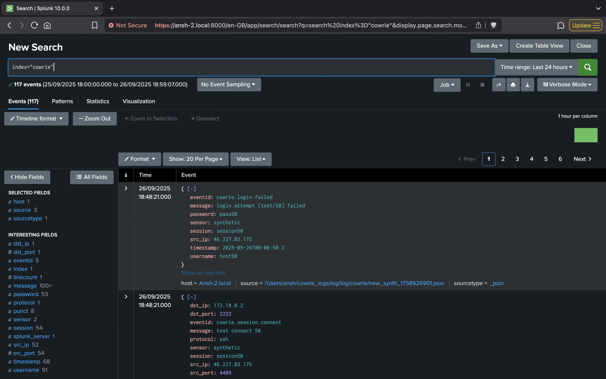
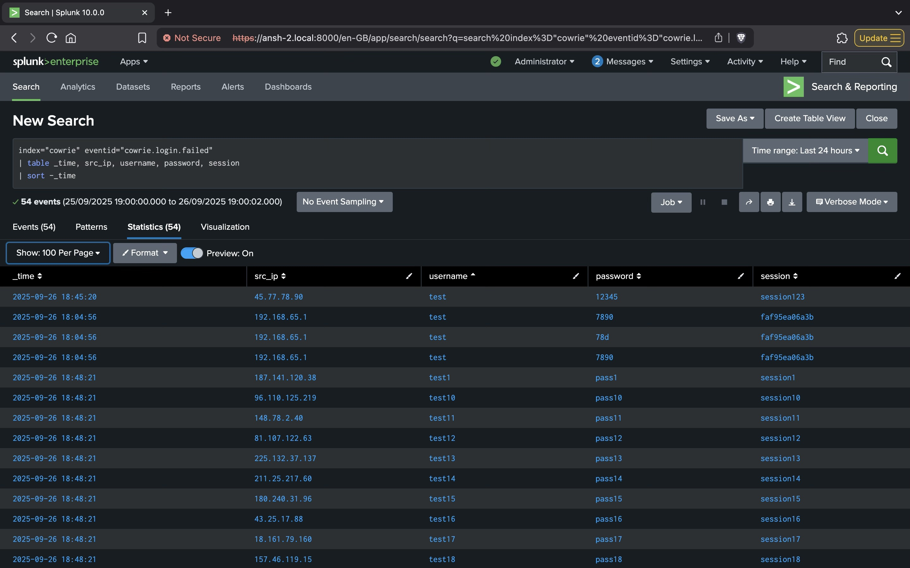
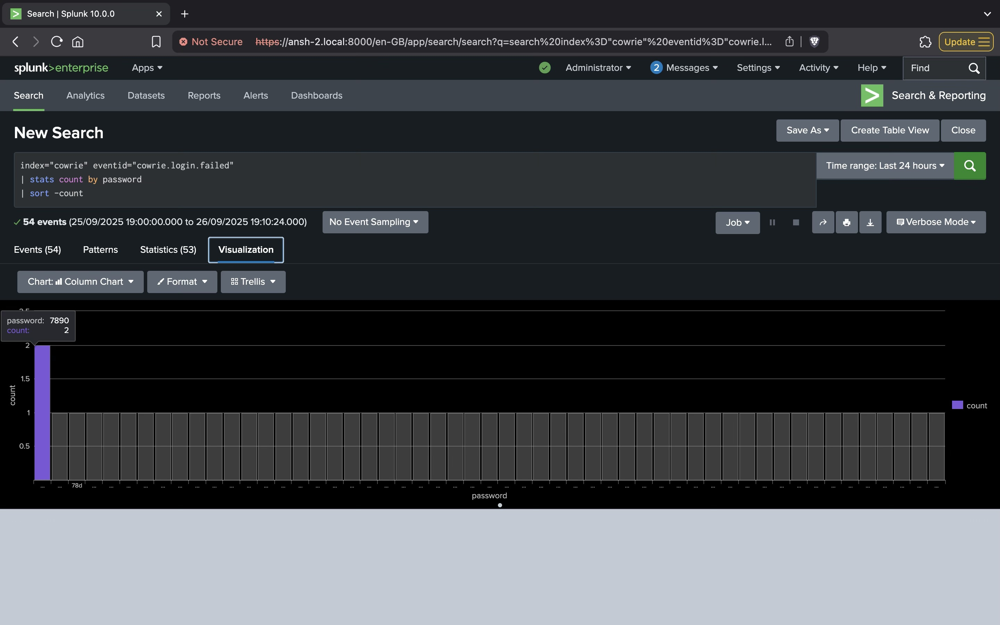
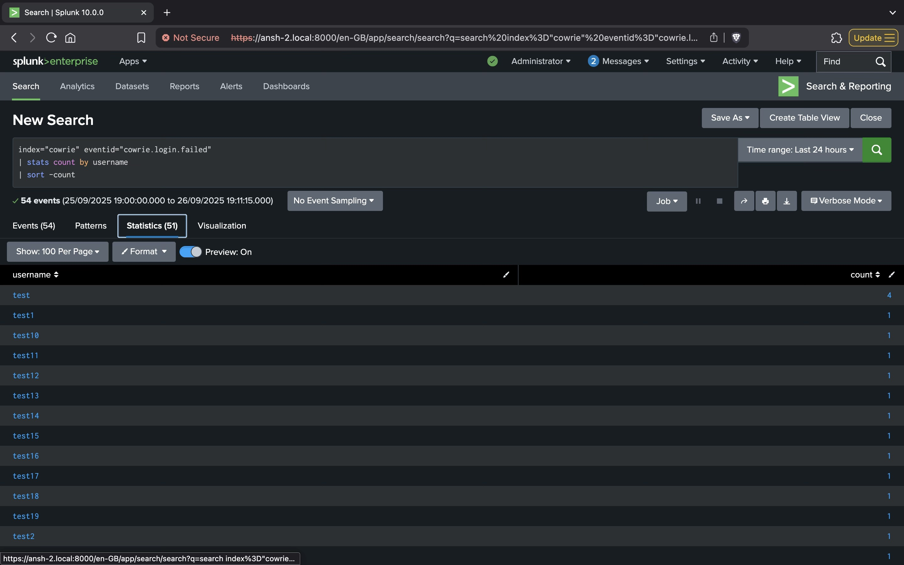
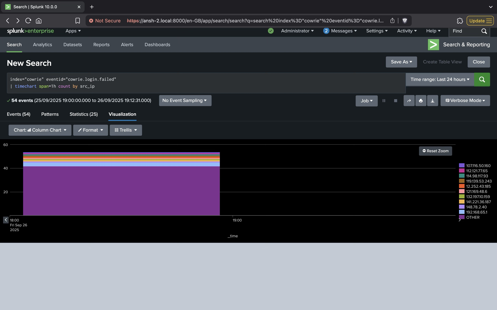
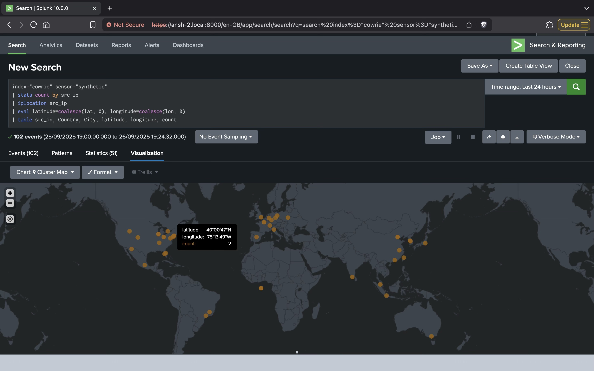

# ssh-honeypot-analysis
Hands-on SOC project with Cowrie Honeypot and Splunk. I set up a Docker-based honeypot to log SSH brute-force attacks, ingested the data into Splunk, and built dashboards to visualize attacker behavior, passwords, usernames, and GeoIP data while testing alerts for detection use cases.

# SOC Lab Documentation – Cowrie Honeypot Analysis

## Table of Contents
1. [Lab Overview](#1-lab-overview)
2. [Log Verification](#2-log-verification)
3. [Failed Login Analysis](#3-failed-login-analysis)
4. [Most Attempted Passwords](#4-most-attempted-passwords)
5. [Most Targeted Usernames](#5-most-targeted-usernames)
6. [Attack Timeline](#6-attack-timeline)
7. [Suspicious IP Investigation](#7-suspicious-ip-investigation)
8. [GeoIP Enrichment](#8-geoip-enrichment)
9. [Dashboards & Alerts](#9-dashboards--alerts)
10. [Summary & Findings](#10-summary--findings)
    

## 1. Lab Overview
**Objective:** Capture and analyze SSH brute-force attempts using Cowrie Honeypot and Splunk.  

**Environment Details:**  
- Host / VM: Local machine (MacBook, Docker Desktop)  
- Cowrie Version: `cowrie/cowrie:latest` (Docker Hub)  
- Splunk Version: Splunk Enterprise 9.2.1  
- Ports Exposed: SSH 2222  
- Log Directory: `~/cowrie_logs/log/`  

**Lab Steps Overview:**  
- Deploy Cowrie Docker container  
- Configure persistent log storage  
- Verify logs are captured in Splunk  


---

## 2. Log Verification
**Objective:** Ensure Cowrie logs are being generated and ingested into Splunk.  

**Commands Used:**
```bash
ls -lah ~/cowrie_logs/log/
tail -f ~/cowrie_logs/log/cowrie.json
````

**Splunk Search Used:**

```spl
index="cowrie"
```

**Observations:**

* Total events captured: **117**
* Event types observed:

  * `cowrie.session.connect` → new SSH connection attempts
  * `cowrie.login.failed` → failed login attempts
  * `cowrie.client.version` → SSH client version
  * `cowrie.client.kex` → key exchange events

)

---

## 3. Failed Login Analysis

**Objective:** Identify brute-force login attempts and attacker behavior.

**Splunk Query:**

```spl
index="cowrie" eventid="cowrie.login.failed"
| table _time, src_ip, username, password, session
| sort -_time
```

**Observations:**

* Top attacking IPs: `46.227.83.175` (most frequent), followed by `150.173.160.36`, `141.221.36.187`, `107.116.50.160`
* Repeated usernames/passwords: `test/7890` appeared twice; all others appeared only once
)
---

## 4. Most Attempted Passwords

**Splunk Query:**

```spl
index="cowrie" eventid="cowrie.login.failed"
| stats count by password
| sort -count
```

**Observations:**

* Most common password: `7890`



---

## 5. Most Targeted Usernames

**Splunk Query:**

```spl
index="cowrie" eventid="cowrie.login.failed"
| stats count by username
| sort -count
```

**Observations:**

* Most targeted username: `test`




---

## 6. Attack Timeline

**Splunk Query:**

```spl
index="cowrie" eventid="cowrie.login.failed"
| timechart span=1h count by src_ip
```

**Observations:**

* Peak attack hours: **2025-09-26 / 18:00 - 19:00**
* Highly concentrated within a single hour → indicates **synthetic/scripted attack pattern**
* Multiple IPs attempted logins simultaneously, with 42 events from “other” less frequent sources



---

## 7. Suspicious IP Investigation

**Splunk Query:**

```spl
index="cowrie" src_ip="46.227.83.175"
| table _time, username, password, eventid, session
```

**Observations:**

* Repeated login attempts from `46.227.83.175` targeting **session50**
* Sequential usernames & passwords (`test50/pass50`) → **scripted testing**
* No successful logins → Cowrie correctly captured failed attempts


---

## 8. GeoIP Enrichment

Some IPs may appear at coordinates `(0,0)` when they cannot be geolocated (private LAN or missing GeoIP data).
Using `coalesce(lat,0)` and `coalesce(lon,0)` ensures these events are represented on the map.

**Splunk Query:**

```spl
index="cowrie" sensor="synthetic"
| stats count by src_ip
| iplocation src_ip
| eval latitude=coalesce(lat, 0), longitude=coalesce(lon, 0)
| table src_ip, Country, City, latitude, longitude, count
```

**Observations:**

* Synthetic attacks spread across multiple countries
* **Top Countries:** United States, China, Brazil, Taiwan, South Korea



---

## 9. Dashboards & Alerts

**Dashboard Panels:**

* Failed login attempts over time
* Top passwords attempted
* Top usernames attacked

**Alerts Setup Example:**
Trigger alert if **>5 failed attempts from the same IP in 10 minutes**.


---

## 10. Summary & Findings

* **Total Events Captured:** 117
* **Top Attacking IPs:** 46.227.83.175, 150.173.160.36, 141.221.36.187, 107.116.50.160
* **Most Common Passwords:** 7890
* **Most Targeted Usernames:** test
* **Attack Timeline:** Peaks observed during synthetic generation, distributed across countries

**Conclusion:**
This lab demonstrates how a Cowrie honeypot captures SSH brute-force attempts, how Splunk ingests and visualizes data, and how patterns such as repeated login attempts, top usernames/passwords, and attacker IPs can be analyzed.
Synthetic events are useful for testing dashboards, GeoIP enrichment, and alerting mechanisms.


Do you want me to also make a **short version (2–3 paragraphs) for LinkedIn**, while this long one stays in GitHub?
```
